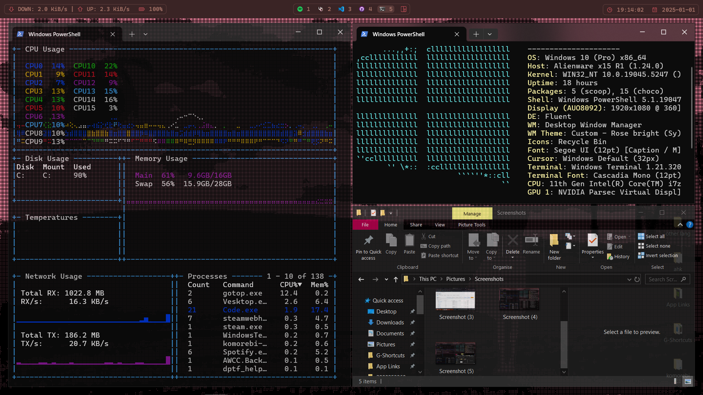
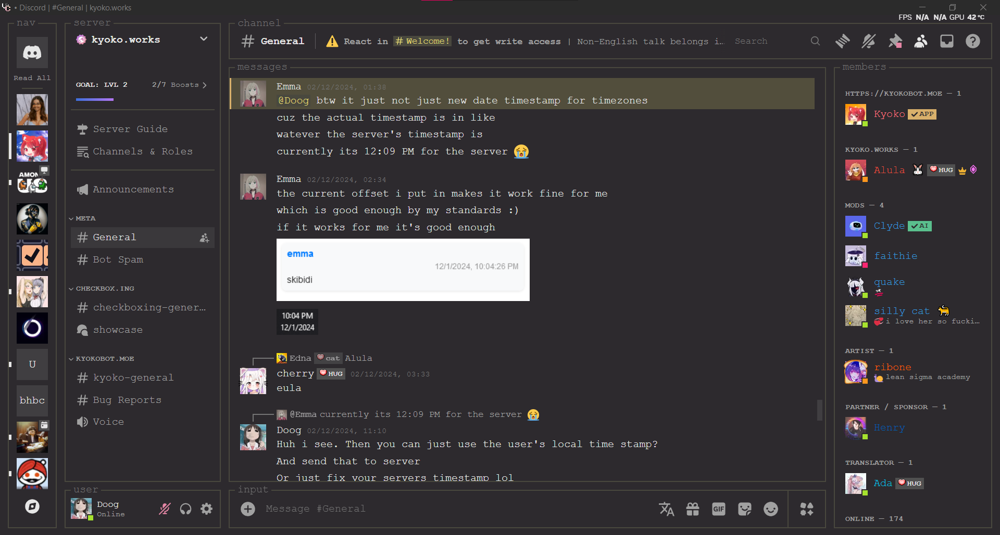

# Dotfiles

Files that I use for configuration of software.

Follow `filemap.json` to know where to put what files. They're currently localised to my system, but you can make out what yours would be.

Run `.\sync_files.bat` to automatically sync all files from filemap.

## Komorebi

+ Install komorebi with scoop for windows. Follow their guide for the appropriate commands (there's 2 packages).
+ Do `komorebic quickstart`
+ Run with `komorebic start --whkd --bar` ( This start the hotkey daemon and the bar on top, you can include --masir if you'd like mouse-following focus too)
+ Additionally, hide the windows taskbar and add a startup script to task manager for this. `powershell.exe` with params being the startup script.
+ You may also choose to do `komorebic enable-autostart` but that has problems for my system.
+ My wallpaper is [lain_bliss](https://steamcommunity.com/sharedfiles/filedetails/?id=2686491283) by [deicha torar](https://steamcommunity.com/id/neveirissimo/) running on wallpaper engine. The video is available on [youtube](https://youtu.be/atMcPxyksGM) if you'd like to load it on your own animated wallpaper client.
+ Additionally, I use [komorebi-loader](https://github.com/SuppliedOrange/komorebi-loading) with this system but that's a completely optional reqirement.

### Preview

## Vesktop

+ Install [Vesktop](https://github.com/Vencord/Vesktop) from their github repo.
+ Open up the "themes" page in your Vesktop (Discord) settings and click on "Open Themes Folder". You can google how to do so if this changes in the future.
+ Put in your desired themes/plugins from the "vesktop" category in this repo.

### Preview
